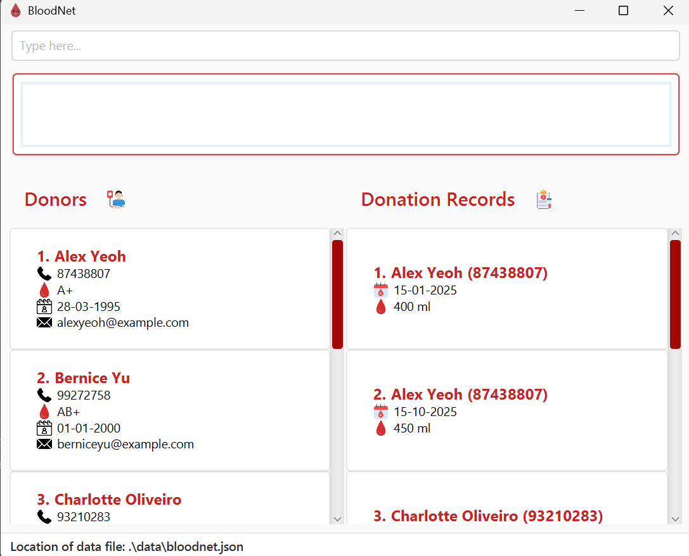
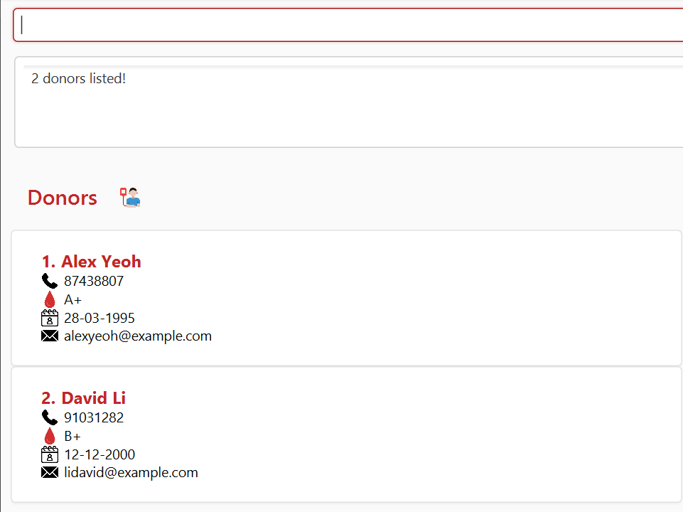
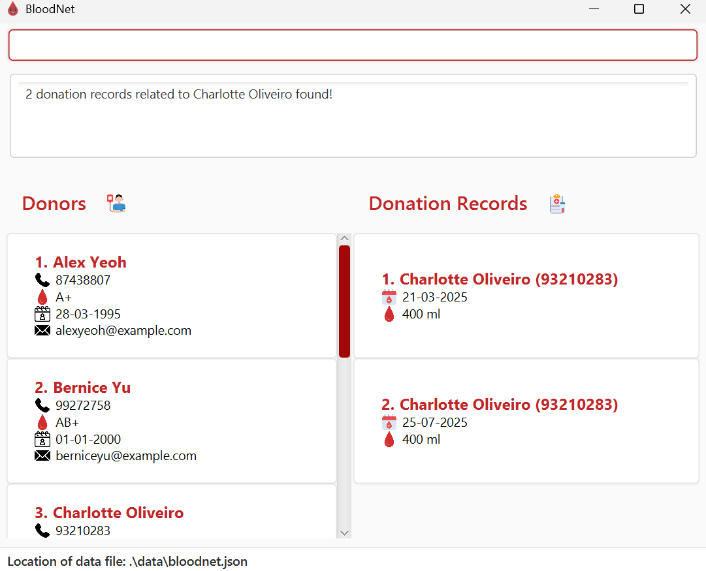

# BloodNet User Guide

BloodNet is a **desktop app for tracking blood donors and their donations**. It helps data entry staff:

1. Quickly search for the contact information of any donor
2. Easily view all donation records of any donor
3. Instantly collate a list of eligible donors of any specified blood group

It is a standalone application which doesn't connect to the internet, making it perfect in parts of the world where
internet connectivity is unreliable.

BloodNet's mode of input resembles that of a Command Line Interface (CLI), making it perfect for fast typists. On the
other hand, its Graphical User Interface (GUI) enables scrolling, making it easy to view large amounts of data at a
time.

--------------------------------------------------------------------------------------------------------------------

## Quick Start

1. Install Java 17 if you computer doesn't already have it. The instructions for how to do so can be
   found [here](https://se-education.org/guides/tutorials/javaInstallation.html).

2. Download the `.jar` file from our latest [Github Release](https://github.com/AY2526S1-CS2103T-T16-4/tp/releases).
   The `.jar` file can be found in the `Assets` section.

3. Copy the file to the folder you want to use as the _home folder_ for your BloodNet application.

4. Navigate to the folder. Then, right click in any empty area in the folder and select `Open in Terminal`.
     
   
     
   A black window will appear. Key in `java -jar bloodnet.jar` and press <kbd>Enter</kbd>.
     
   
     
   A GUI similar to the below should appear in a few seconds. Note how the app contains some sample data.
     
   

5. Type the command in the command box and press <kbd>Enter</kbd> to execute it. e.g. typing **`help`** and
   pressing <kbd>Enter</kbd> will
   open the help window. 
   Some example commands you can try:

    * `add n/John Doe p/98765432 e/johnd@example.com b/A+ d/21-06-2003` : Adds a donor named `John Doe` to BloodNet.

    * `list` : Lists all donors.

    * `delete 3` : Deletes the 3rd donor shown in the current donor list.

    * `adddonation p/1 d/21-10-2025 v/500` : Adds a donation record for the 1st donor shown in the current donor
      list.

    * `findeligible O+ A+` : Finds all donors with the specified blood type(s) provided who are currently eligible to
      donate based on their date of birth and number of days since last donation.

    * `clear`: Deletes all data from the app. This command can be used to delete all sample data from the app.

    * `exit` : Exits the app.

6. Press <kbd>F1</kbd> or type **`help`** in the command box and press <kbd>Enter</kbd> to open
   the [help window](#viewing-help--help), which provides a summary of all command usages.

7. Refer to the [Features](#features) below for details of each command.

--------------------------------------------------------------------------------------------------------------------

## Command summary

 Action                                                                                     | Format, Examples                                                                                                                                                                                 
--------------------------------------------------------------------------------------------|--------------------------------------------------------------------------------------------------------------------------------------------------------------------------------------------------
 [**Add Donor**](#adding-a-donor-add)                                                       | `add n/NAME p/PHONE e/EMAIL b/BLOOD_TYPE d/DATE_OF_BIRTH_(DD-MM-YYYY)`   e.g., `add n/James Ho p/98765432 e/jamesho@example.com b/A+ d/22-11-2004`                                            
 [**List All Donors**](#listing-all-donors-list)                                            | `list`                                                                                                                                                                                           
 [**Find Donor**](#locating-donors-by-name-find)                                            | `find KEYWORD...`  e.g., `find alice bob charlie`                                                                                                                                             
 [**Edit Donor**](#editing-a-donor-edit)                                                    | `edit DONOR_LIST_INDEX_(MUST_BE_A_POSITIVE_WHOLE_NUMBER) [n/NAME] [p/PHONE_NUMBER] [e/EMAIL] [b/BLOOD_TYPE] [d/DATE_OF_BIRTH_(DD-MM-YYYY)]`  e.g.,`edit 2 n/James Lee e/jameslee@example.com` 
 [**Delete Donor**](#deleting-a-donor-delete)                                               | `delete DONOR_LIST_INDEX_(MUST_BE_A_POSITIVE_WHOLE_NUMBER) `  e.g., `delete 3`                                                                                                                
 [**Add Donation Records**](#adding-a-donation-record-adddonation)                          | `adddonation p/DONOR_LIST_INDEX_(MUST_BE_A_POSITIVE_WHOLE_NUMBER) d/DONATION_DATE v/BLOOD_VOLUME`   e.g., `adddonation p/1 d/15-10-2025 v/200`                                                
 [**Find Donation Records of a Donor**](#finding-donation-records-of-a-donor-finddonations) | `finddonations DONOR_LIST_INDEX_(MUST_BE_A_POSITIVE_WHOLE_NUMBER)`   e.g., `finddonations 3`                                                                                                  
 [**Edit Donation Records**](#editing-a-donation-record-editdonation)                       | `editdonation DONATION_RECORD_LIST_INDEX_(MUST_BE_A_POSITIVE_WHOLE_NUMBER)`  e.g., `editdonation 1 v/350 d/20-02-2025`                                                                        
 [**Delete Donation Records**](#deleting-a-donation-record-deletedonation)                  | `deletedonation DONATION_RECORD_LIST_INDEX_(MUST_BE_A_POSITIVE_WHOLE_NUMBER)`  e.g., `deletedonation 1`                                                                                       
 [**Find Eligible Donors**](#finding-eligible-donors-based-on-blood-type-findeligible)      | `findeligible BLOOD_TYPE...`  e.g., `findeligible A+ O+ B+`                                                                                                                                   
 [**Delete All Data**](#clearing-all-entries-clear)                                         | `clear`                                                                                                                                                                                          
 [**Help**](#viewing-help-help)                                                             | `help`                                                                                                                                                                                           
 [**Exit**](#exiting-the-program-exit)                                                      | `exit`                                                                                                                                                                                           

--------------------------------------------------------------------------------------------------------------------

## Features

<box type="info" seamless>

**Notes about the command format:** 

* Words in `UPPER_CASE` are the parameters to be supplied by the user. 
  e.g. in `add n/NAME p/PHONE e/EMAIL b/BLOOD_TYPE d/DATE_OF_BIRTH`, `NAME`, `PHONE`, `EMAIL`, `BLOOD_TYPE`
  and `DATE_OF_BIRTH` are parameters which can be used
  as `add n/John Doe p/98124309 e/john@gmail.com b/A+ d/22-11-2004`.

* Parameters can be in any order. 
  e.g. if the command specifies `n/NAME b/BLOOD_TYPE`, `b/BLOOD_TYPE n/NAME` is also acceptable.

* Extraneous parameters for commands that do not take in parameters (such as `help`, `list`, `exit` and `clear`) will be
  ignored. 
  e.g. if the command specifies `help 123`, it will be interpreted as `help`.

* Parameters enclosed in square brackets, `[]`, are optional.
  e.g., in `editdonation DONATION_RECORD_LIST_INDEX [d/DONATION_DATE] [v/BLOOD_VOLUME]`, `[d/DONATION_DATE]`
  and `[v/BLOOD_VOLUME]` may each be omitted.
    * **Note**: Although parameters may be marked as optional, there may be cases where at least one of the optional
      parameters must be provided (such as in `editdonation` and `edit`). When this applies, it will be explicitly
      stated both in this user guide and in the in-application help messages.

* Parameters followed by ellipsis (`...`) indicate that multiple **but at least one** value(s) must be supplied by the
  user.
  e.g., in `findeligible BLOOD_TYPE...`, `findeligible A+` and `findeligible A+ B+ O-` are all valid commands
  but `findeligible` with no parameters is an invalid command.

* If you are using a PDF version of this document, be careful when copying and pasting commands that span multiple lines
  as space characters surrounding line-breaks may be omitted when copied over to the application.

  </box>

### Adding a donor: `add`

This command is used to add a donor to the BloodNet system.

Format: `add n/NAME p/PHONE_NUMBER e/EMAIL b/BLOOD_TYPE d/DATE_OF_BIRTH`

* BLOOD_TYPE must be either O+, O-, A+, A-, B+, B-, AB+, AB-.
* DATE_OF_BIRTH must be in the *dd-MM-yyyy* format (for example: 20-01-2003).

Examples:

* `add n/John Doe p/98765432 e/johnd@example.com b/B+ d/04-11-1999`
* `add n/Betsy Crowe e/betsycrowe@example.com b/O- d/20-05-2004`

### Listing all donors: `list`

Shows a list of all donors in the BloodNet system.

Format: `list`

### Locating donors by name: `find`

Finds donors whose names contain any of the given keywords.

Format: `find KEYWORD...`

* At least one keyword must be provided.
* The search is case-insensitive. e.g. `hans` will match `Hans`.
* The order of the keywords does not matter. e.g. `Hans Bo` will match `Bo Hans`.
* Only the name is searched.
* Persons matching at least one keyword will be returned (i.e. `OR` search).
  e.g. `Hans Bo` will return `Hans Gruber`, `Bo Yang`.

Examples:

* `find John` returns `john` and `John Doe`
* `find alex david` returns `Alex Yeoh`, `David Li` 

  

### Editing a donor: `edit`

The command edits an existing donor in the BloodNet system.

Format: `edit DONOR_LIST_INDEX [n/NAME] [p/PHONE] [e/EMAIL] [b/BLOOD_TYPE] [d/DATE_OF_BIRTH]`

* Edits the person at the specified `DONOR_LIST_INDEX`. The index refers to the index number shown in the
  displayed donor list. The specified index **must be a positive whole number** 1, 2, 3, …​
* At least one of the optional fields must be provided.
* Existing values will be updated to the input values.
* New values of the fields must satisfy the validation rules as outlined for the `adddonation` command above.

Examples:

* `edit 1 p/91234567 e/johndoe@example.com` Edits the phone number and email address of the 1st person to be `91234567`
  and `johndoe@example.com` respectively.
* `edit 2 n/Betsy Crower ` Edits the name of the 2nd person to be `Betsy Crower`.
* `find Betsy` followed by `edit 1 p/91234567` edits the phone number of the 1st donor in the result of the `find`
  command.

### Deleting a donor: `delete`

This command deletes a specified donor from the BloodNet system.

Format: `delete DONOR_LIST_INDEX`

* Deletes the donor at the specified `DONOR_LIST_INDEX`.
* The index refers to the index number shown in the displayed donor list.
* The index **must be a positive whole number** 1, 2, 3, …​
* If the specified donor has donation records, those donation records will have to be deleted first using the
  `deletedonation` command before the donor can be deleted.

<box type="warning" seamless>

**Caution:**
This operation is irreversible! As such, the system will prompt you for confirmation before proceeding with the
deletion.
</box>

Examples:

* `list` followed by `delete 2` deletes the 2nd donor in the BloodNet system.
* `find Betsy` followed by `delete 1` deletes the 1st donor in the result of the `find` command.

### Adding a donation record: `adddonation`

This command can be used to add a donation record for a donor.

Format: `adddonation p/DONOR_LIST_INDEX d/DONATION_DATE v/BLOOD_VOLUME`

* Adds a donation record for the donor corresponding to the specified `DONOR_LIST_INDEX`.
* The index refers to the index number shown in the displayed donor list.
* The index **must be a positive whole number** 1, 2, 3, …​
* DONATION_DATE must be in the *dd-MM-yyyy* format.
* BLOOD_VOLUME **must be a positive whole number** strictly **less than 500** (in milliliters).

Examples:

* `adddonation p/1 d/15-10-2025 v/200` adds a donation record for the 1st donor, with a blood volume of 200ml donated on
  15-10-2025.
* `adddonation p/3 d/20-09-2024 v/450` adds a donation record for the 3rd donor, with a blood volume of 450ml donated on
  20-09-2024.

## Finding donation records of a donor: `finddonations`

This command finds donation records of a donor.

Format: `finddonations DONOR_LIST_INDEX`

* List all donation records of the donor at the specified `DONOR_LIST_INDEX`.
* The index refers to the index number shown in the displayed donor list.
* The specified index **must be a positive whole number** 1, 2, 3, ...

Example:

* `finddonations 3`: List all donation records of the 3rd donor in the donor list.

  

### Editing a donation record: `editdonation`

This command edits an existing donation record in the BloodNet system.

Format: `editdonation DONATION_RECORD_LIST_INDEX [d/DONATION_DATE] [v/BLOOD_VOLUME]`

* Edits the donation record at the specified `DONATION_RECORD_LIST_INDEX`. The index refers to the index number shown in
  the
  displayed donation record list. The specified index **must be a positive whole number** 1, 2, 3, …​
* At least one of the optional fields must be provided.
* Existing values will be updated to the input values.
* DONATION_DATE must be in the *dd-MM-yyyy* format.
* BLOOD_VOLUME **must be a whole number** strictly **less than 500** (in milliliters).

Examples:

* `editdonation 1 v/200` Edits the blood volume of the 1st donation record in the entire donation record list.
* `editdonation 3 d/13-10-2024` Edits the donation date of the 3rd donation record to 13-10-2024.
* `editdonation 2 d/01-01-2025 v/350` Edits both the donation date and blood volume of the 2nd donation record.

### Deleting a donation record: `deletedonation`

This command deletes a specified donation record from the BloodNet system.

Format: `deletedonation DONATION_RECORD_LIST_INDEX`

* Deletes the donation record at the specified `DONATION_RECORD_LIST_INDEX`.
* The index refers to the index number shown in the displayed donation record list.
* The index **must be a positive whole number** 1, 2, 3, …​

<box type="warning" seamless>

**Caution:**
This operation is irreversible! As such, the system will prompt you for confirmation before proceeding with the
deletion.
</box>

Examples:

* `deletedonations 1` deletes the 1st donation record in the donation record list.
* `finddonations 1` followed by `deletedonation 2` deletes the 2nd donation record of the 1st donor in the shown donor
  list.

### Finding eligible donors based on blood type: `findeligible`

This command finds all people who are eligible to donate blood for the specified blood type(s) on the current day.

Format: `findeligible BLOOD_TYPE...`

* The search is case-insensitive. e.g. `O+` and `o+` will match the blood type of someone with blood type O+.
* Eligibility criteria are based on official guidelines. The donor’s date of birth and
  how long it has been since their last blood donation are both considered when determining eligibility.

Example:

* `findeligible A+ B+`: Lists all donors who have blood type A+ or B+ and are found eligible to donate based on the
  official guidelines.

  

### Clearing all entries: `clear`

Clears all entries from the BloodNet system.

Format: `clear`

<box type="warning" seamless>

**Caution:**
This operation is irreversible and will lead to significant data loss if unintended! Therefore, the system
will prompt you for confirmation before deleting all data. Even if deleting all data is the desired course of action, it
is recommended to create a backup of the data file before running this command as you may change your mind later on.
</box>

### Viewing help: `help`

If you need a refresher on the formats of the various commands, use this command! It will provide a summary of the
formats of each command, as well as the link to this user guide.

Format: `help`

### Exiting the program: `exit`

Exits the program.

Format: `exit`

### Saving the data

BloodNet data are saved in the hard disk automatically after any command that changes the data. There is no need to save
manually.

### Editing the data file

BloodNet data are saved automatically as a JSON file `[JAR file location]/data/bloodnet.json`. Advanced users are
welcome to update data directly by editing that data file.

<box type="warning" seamless>

**Caution:**
If your changes to the data file makes its format invalid, BloodNet will discard all data and start with an empty data
file at the next run. Hence, it is recommended to take a backup of the file before editing it. 
Furthermore, certain edits can cause the BloodNet to behave in unexpected ways (e.g., if a value entered is outside the
acceptable range). Therefore, edit the data file only if you are confident that you are able to update it correctly.
</box>

--------------------------------------------------------------------------------------------------------------------

## FAQ

**Q**: How do I transfer my data to another Computer? 
**A**: Install the app in the other computer and overwrite the empty data file it creates with the file that contains
the data of your previous BloodNet home folder. 
**Q**: Are the donor list and donation records list synchronised?
**A**: **No.** The two lists should be treated as largely independent. The only time they interact is for
donation-related commands that require a donor to be specified (e.g., `finddonations`, `adddonation`). In these cases,
the donor index used as a parameter is derived from the shown donor list.

--------------------------------------------------------------------------------------------------------------------

## Known issues

1. **When using multiple screens**, if you move the application to a secondary screen, and later switch to using only
   the primary screen, the GUI will open off-screen. The remedy is to delete the `preferences.json` file created by the
   application before running the application again.
2. **If you minimize the Help Window** and then run the `help` command (or use the `Help` menu, or the keyboard
   shortcut `F1`) again, the original Help Window will remain minimized, and no new Help Window will appear. The remedy
   is to manually restore the minimized Help Window.
